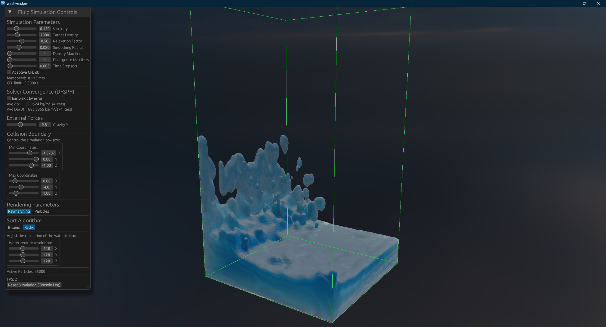
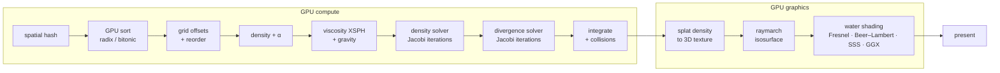
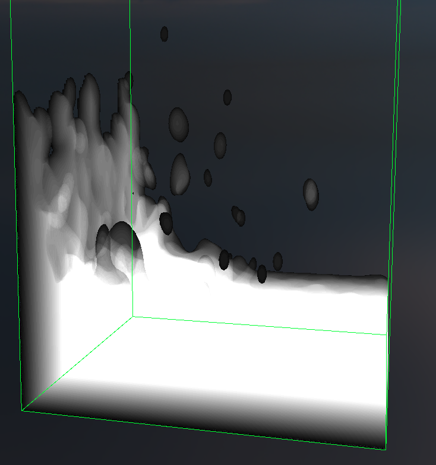
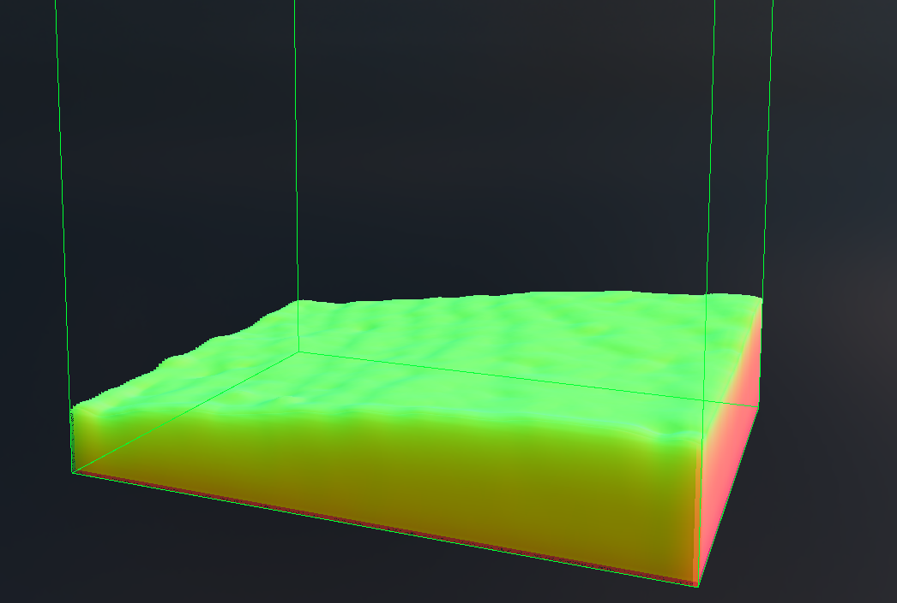
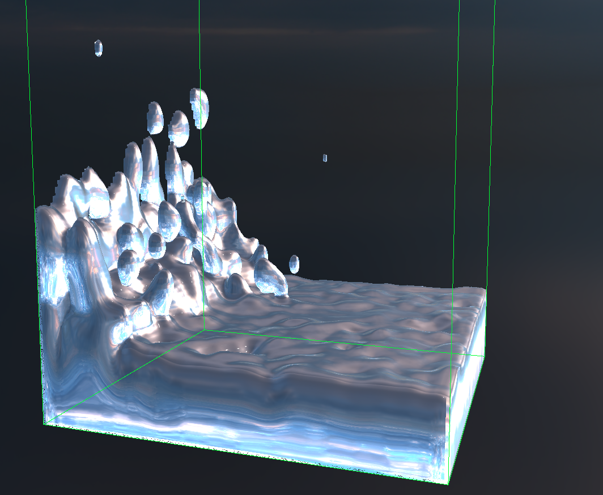
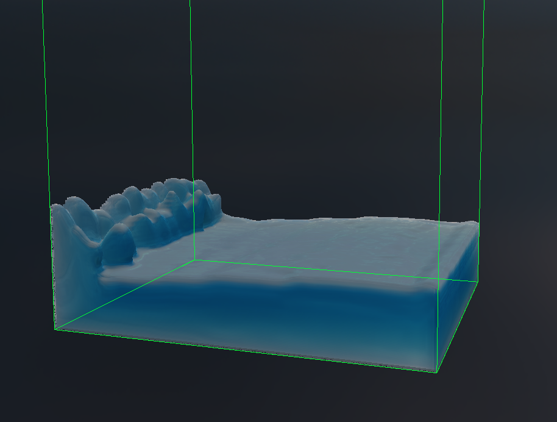
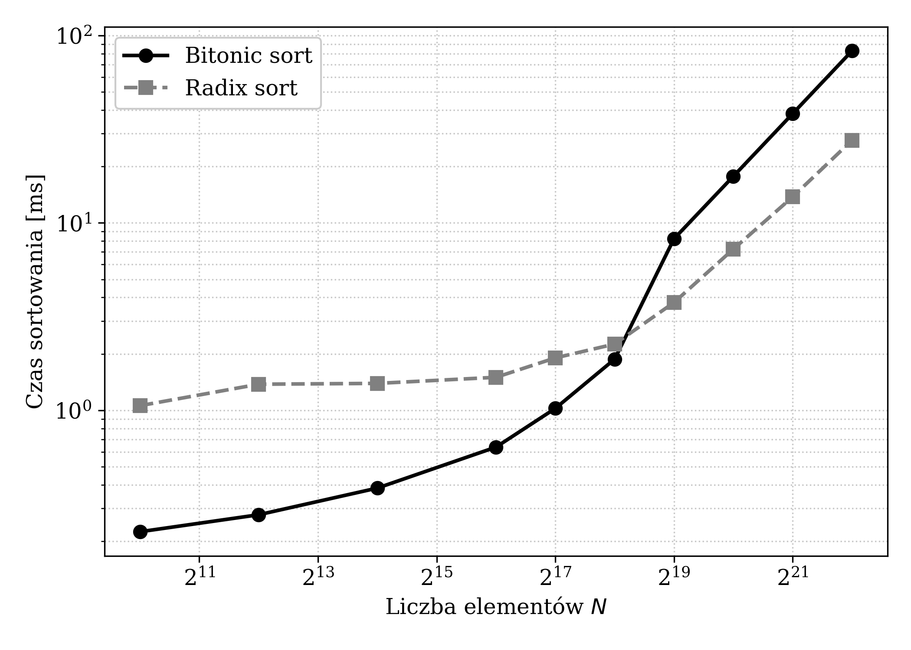

<div align="center">

# Fluid Engine

**Real-time SPH fluid simulation, computed and rendered entirely on the GPU.**

Written from scratch in Rust on top of the Vulkan API — no game engine, no physics middleware.




</div>

---

## What is this?

A personal project I built during my studies to understand — at the lowest practical level — how modern real-time particle simulations actually work. Instead of using an existing engine, every layer is implemented by hand:

- the **physics**: a Divergence-Free SPH (DFSPH) solver that keeps the fluid incompressible,
- the **acceleration structures**: spatial hashing with GPU sorting and cache-friendly buffer reordering,
- the **rendering**: volumetric raymarching with a physically-motivated water shading model,
- the **engine glue**: windowing, input, camera, GPU resource management and frame synchronization.

The CPU's only job is to record Vulkan command buffers. Every simulation and rendering step — neighbor search, sorting, pressure solves, integration, density splatting, raymarching — runs as GPU compute or graphics work, every frame, in real time.

## Highlights

- 🌊 **DFSPH solver** ([Bender & Koschier 2015](https://animation.rwth-aachen.de/media/papers/2015-SCA-DFSPH.pdf)) — two cooperating iterative pressure solvers: one corrects density error, the other zeroes out velocity-field divergence, which permits larger time steps than classic SPH
- ⚡ **17 GLSL compute shaders** orchestrated through a uniform `ComputeStep` abstraction: one-time pipeline compilation from SPIR-V reflection, zero per-frame allocations
- 🔍 **O(1) neighbor search** — uniform-grid spatial hashing ([Green 2010](https://developer.download.nvidia.com/assets/cuda/files/particles.pdf)) with a four-stage pipeline: hash → sort → offsets → reorder, so each particle reads its 27-cell neighborhood from coalesced memory
- 🔀 **Two GPU sorting algorithms, benchmarked** — bitonic sort and 8-bit-digit radix sort (count / Hillis–Steele scan / stable scatter), switchable at runtime; radix turned out ~6× faster inside the full frame pipeline
- 🧱 **SOA particle layout with ping-pong double buffering** — structurally eliminates GPU read/write races instead of patching them with barriers
- 💡 **Volumetric water rendering** — density splatting into a 3D texture via atomic adds, raymarching with 8-step bisection refinement, and a shading model combining Fresnel reflection/refraction, Beer–Lambert absorption, subsurface scattering, GGX specular and HDRI environment lighting
- 🎛️ **Live tuning UI** (egui) — viscosity, rest density, solver iterations, time step, adaptive CFL toggle, simulation bounds, render mode and sort algorithm, all adjustable while the simulation runs
- 📊 **Measured, not guessed** — Tracy profiler integration (CPU + GPU zones), reproducible benchmark scripts, and convergence analysis of both solvers

## How a frame works



Both pressure solvers share the same matrix-free Jacobi iteration (`pressure_force` → `pressure_update`); they differ only in the source term — density deviation `(ρ₀ − ρᵢ)/Δt − ∇·v` versus pure divergence `−∇·v` — and in whether the result integrates positions or only velocities.

## Rendering breakdown

The water surface is never meshed. Particle densities are splatted into a `R32Uint` 3D texture (atomic adds, smooth `(1−q²)³` falloff), and a fragment shader marches camera rays through it — AABB entry test, fixed-step march, then 8 bisection steps to pin the isosurface to ~0.4% of a step. Surface normals come from central differences on the density field.

| Thickness (drives absorption) | Normals |
|:---:|:---:|
|  |  |
| **Specular reflection** | **Refraction + subsurface scattering** |
|  |  |

The final color blends refraction (background through Beer–Lambert absorption, tinted by wrapped-diffuse SSS) with reflection by the Schlick–Fresnel factor, adds a GGX sun highlight and a foam mask on thin, upward-facing regions, then tonemaps with Reinhard. Both reflected and refracted rays sample the same equirectangular HDRI panorama, keeping the lighting consistent between water and sky.

## Performance notes

<div align="center">

</div>

Sorting the particle grid is the most expensive part of the neighbor search, so both algorithms are implemented and measured rather than assumed:

| | Bitonic | Radix (8-bit digits) |
|---|---|---|
| Complexity | O(N log² N) | O(kN), k = 4 |
| Dispatches for N = 2¹⁵ | 120 | 12 |
| Isolated sort, N = 2²² | 82.6 ms | **30.5 ms** |
| Full neighbor-search step, 25k particles | 3.64 ms | **616 µs** |

The interesting result: in isolation the crossover sits around N ≈ 2¹⁸, but inside the real frame — where every dispatch is fenced by pipeline barriers against the rest of the solver — radix wins at *every* practical particle count, because the cost scales with dispatch count, not just arithmetic. Profiles captured with [Tracy](https://github.com/wolfpld/tracy); benchmark plots are reproducible from `scripts/`.

Solver convergence (average density and divergence error vs. Jacobi iteration count) is analyzed the same way — see `docs/Fluid_Simulation/figures/convergence.png` and the discussion of the free-surface kernel deficit below.

## Getting started

**Requirements**

| | |
|---|---|
| OS | Windows 10 (2004+) |
| GPU | Vulkan 1.3 capable (GTX 1000 / RX 400 class or newer) |
| Toolchain | Rust 1.85+ (edition 2024), MSVC Build Tools |
| SDK | [Vulkan SDK](https://vulkan.lunarg.com/) 1.3.x (provides `shaderc` for build-time GLSL → SPIR-V compilation) |

**Build & run**

```bash
git clone https://github.com/Nikita-Lysiuk/Fluid-Engine.git
cd Fluid-Engine
cargo run --release
```

Shaders are compiled to SPIR-V at build time by `vulkano-shaders` — no manual compile step.

**Controls**

| Input | Action |
|---|---|
| `LMB` | capture cursor / enter camera mode |
| `Esc` | release cursor |
| Mouse | look around |
| `W` `A` `S` `D` | move camera |
| `E` / `Q` | move up / down |
| UI panel | physics parameters, render mode (raymarching ↔ particles), sort algorithm, simulation bounds, CFL and solver-error toggles |

## Project structure

```
src/
├── core/            # winit event loop, scene state, input controller (Command pattern)
├── entities/        # camera (quaternion FPS-style), particles, water, sky, collision box
├── renderer/
│   ├── pipelines/   # one module per GPU pass: neighbor search, sorters, DFSPH steps,
│   │                #   splatting, raymarching, sky, stats — all behind the ComputeStep trait
│   ├── resources.rs # SOA particle buffers, double buffering, descriptor management
│   └── ui.rs        # egui control panel
└── utils/           # constants, FPS counter, shader loading
shaders/
├── compute/         # 17 compute shaders (solver, hashing, two sorters, splatting, stats)
└── *.vert/.frag     # sky, particle, collision-box and raymarching pipelines
scripts/             # Python benchmark/analysis plots (matplotlib) + measured CSV data
docs/                # in-depth technical write-up and figures
```

**Stack:** [vulkano](https://github.com/vulkano-rs/vulkano) (safe Vulkan wrapper), [winit](https://github.com/rust-windowing/winit), [egui](https://github.com/emilk/egui), [glam](https://github.com/bitshifter/glam-rs) (SIMD math), [tracy-client](https://github.com/wolfpld/tracy) (profiling).

## Known limitations & roadmap

The project deliberately prioritizes the physics layer, and its main open issue is documented rather than hidden: without proper boundary handling (ghost particles), particles at the free surface have an incomplete kernel support, which leaves a persistent density deficit. That deficit caps solver convergence and is exactly what makes a naive adaptive CFL time step unstable — the engine therefore defaults to a fixed `Δt` with a fixed iteration budget, with the adaptive variant available as a UI toggle for experimentation.

Planned / interesting next steps:

- [ ] Ghost-particle boundary handling → unlocks error-threshold convergence and adaptive CFL
- [ ] Surface tension (droplets, capillary effects)
- [ ] Alternative surface rendering: marching cubes, screen-space fluid rendering
- [ ] Hardware ray tracing (`VK_KHR_ray_tracing_pipeline`) for caustics
- [ ] Compressed neighbor lists ([Band et al. 2019](https://doi.org/10.1016/j.cag.2019.04.001)) on the GPU
- [ ] Linux/macOS support, engine-plugin packaging

A detailed write-up of the theory, design decisions and measurements (in Polish) lives in [`docs/Fluid_Simulation`](docs/Fluid_Simulation).

## References

- J. Bender, D. Koschier — [*Divergence-Free Smoothed Particle Hydrodynamics*](https://animation.rwth-aachen.de/media/papers/2015-SCA-DFSPH.pdf), SCA 2015
- D. Koschier et al. — [*SPH Techniques for the Physics Based Simulation of Fluids and Solids*](https://sph-tutorial.physics-simulation.org/), Eurographics Tutorial 2019
- S. Green — [*Particle Simulation using CUDA*](https://developer.download.nvidia.com/assets/cuda/files/particles.pdf), NVIDIA 2010
- M. Teschner et al. — *Optimized Spatial Hashing for Collision Detection of Deformable Objects*, VMV 2003
- T. Harada, J. Howes — *Introduction to GPU Radix Sort*, 2011
- M. Levoy — *Display of Surfaces from Volume Data*, IEEE CG&A 1988
